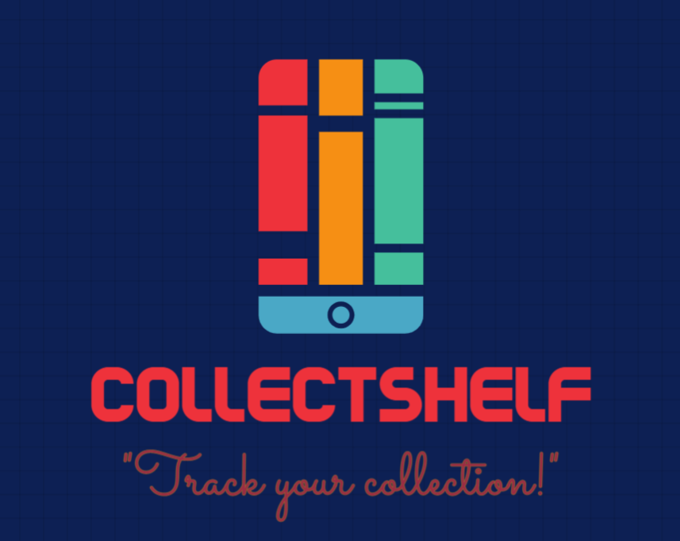
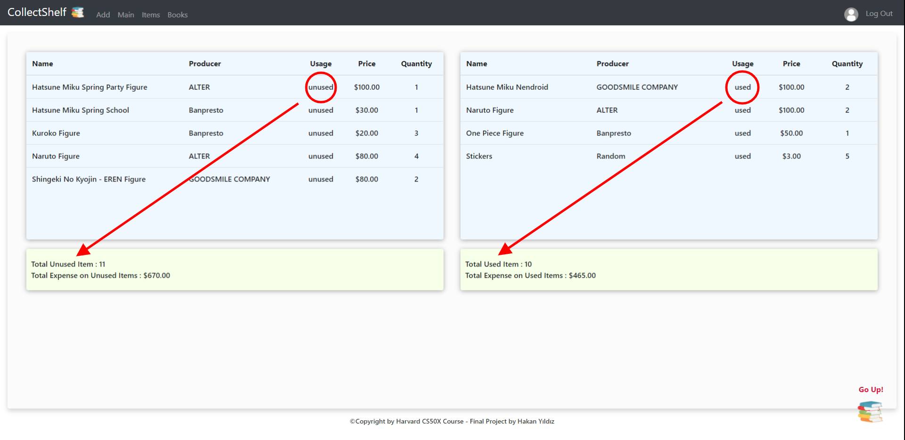
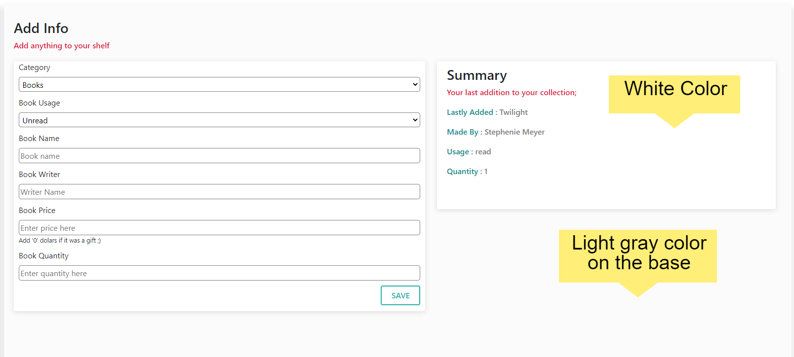
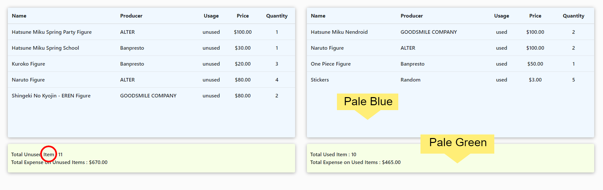
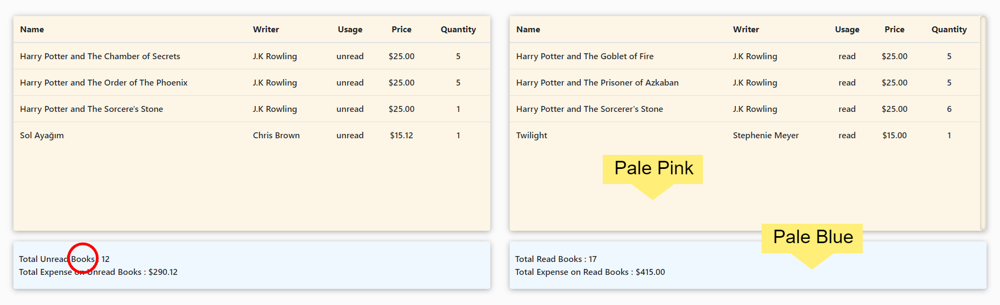
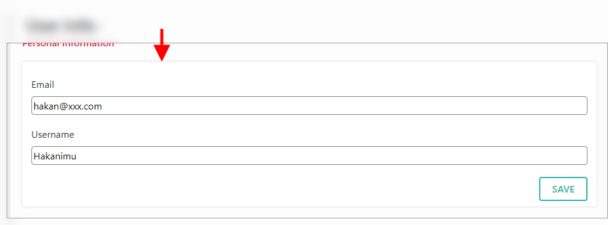
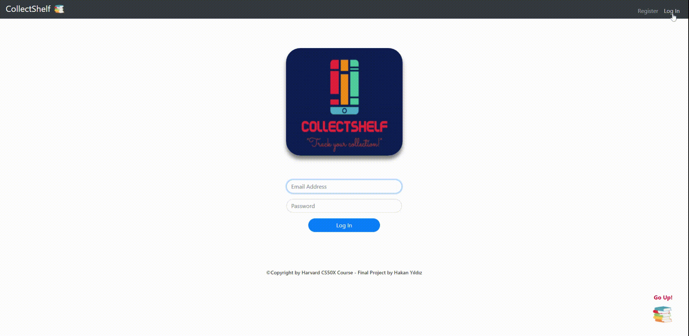

# CollectShelf! :books:     

> 

CollectShelf is a web app that helps collectionists to record their expenses on their either <strong>book collections</strong> or some other <strong>item collections</strong> they are collecting endlessly. Even though the purpose of that web app to help collectionists, since everybody on earth are always buying and using some stuff and trying to calculate their expenses, this app is wide open for everybody to track what they bought, how much they spent, what are their totals expenses so far and etc.. for themselves.

 

## Who Can Use It? 🌱➡️🌳

> This web app can be used by **_everybody_** who needs to track what did they buy and how much money they spent on it!
>   
> In App:  

## Technology :computer:

> Technologies were used for this project are listed down below;

#### Front-End 💅

- [x] Flask(Python)
- [x] Jinja
- [x] Javascript
- [x] JQuery
- [x] HTML5
- [x] CSS3
- [x] Bootstrap version 4.5

#### Back-End 💿

- [x] Python
- [x] SQLite3

## Files Written For This Project 👨‍💻

    
HTML Templates

        <ul>
            <li><strong><a href="./templates/layout.html">layout.html: </a></strong> The is the main template of our Flask app. All the other templates will be embedded in the body of this template with the power of "Jinja". Also some JS functions are used.</li>
        </ul>
        <ul>
            <li><strong><a href="./templates/login.html">login.html : </a></strong> This is the login template that allows the already registered users to login to their account if they are not registered they can not  enter the website. Once the users type their email and passwords, program will check the currently registered users' email and password infos if they are exist in the database or not. If they are, then it will allow the user to enter the website, if not then throws an error of invalid email or password. In addition to that the animation appears on the page is in this file and it also contains the Javascript functions and events and methods that triggers the animation once the page is loaded</li>
        </ul>
        <ul>
            <li><strong><a href="./templates/register.html">register.html : </a></strong> This is the first template that the new user must fill a form in and then pass to the login to enter the website. The form must be filled correctly otherwise the program throws an error message to the user. Once the user submits the form the program will check if the email that the new user typed is already exists in the database or not. If it is, then the program will throw an error for the user saying like "email already exists" otherewise let's the new user to have an account.</li>
        </ul>
        <ul>
            <li><strong><a href="./templates/main.html">main.html : </a></strong> This is the first page that the user will see after when logged in. Main template shows the total amount of expense user had so far, for their whole collection either it's a an item or book. And gives them a scrollable whole list with time they added on their collection shelf under "Transaction" header. Also shows if the item or the book is used or read by the user or currently untouched and waiting to be used.</li>
        </ul>
        <ul>
            <li><strong><a href="./templates/add.html">add.html : </a></strong> This is the template that user can add new "Items" or "Books" to their shelf and also see the last thing that they added to their collection, under the Summary header. Mini Todo will also help them to track their next plans to add their collection. All those data is saved under the tables of "shelf.db" database as well as the other templates. Depending on the existing item or books the program will flash a different message that the user added another copy of the item or book to the collection. Otherwise it will be a new item or a new book on the shelf </li>
        </ul>
        <ul>
            <li><strong><a href="./templates/items.html">items.html : </a></strong> This was created to show only the "Used" and "Unused" items in two different tables with their prices. And both tables show the total expense for Used and Unused items as well as their total quantities.</li>
        </ul>
        <ul>
            <li><strong><a href="./templates/books.html">books.html : </a></strong> This was created to show only the "Read" and "Unread" books in two different tables with their prices. And both tables show the total expense for Read and Unread books as well as their total quantities.</li>
        </ul>
        <ul>
            <li><strong><a href="./templates/profile.html">profile.html : </a></strong> This was created for the users to be able to change their email addresses, usernames and passwords. And also the same Mini Todo is here again for the track of the goods. Once the user changes the user info or the security info the data in the database will also change, so if the user changes the password he/she has to type the "new password" to login next time.</li>
        </ul>

    
CSS Files

        <ul>
            <li><strong><a href="./static/styles.css">styles.css : </a></strong> This is the layout style that gives the styling for the whole web app. Bootstrap 4 is used as well as some additional CSS styling and selectors</li>
        </ul>
        <ul>
            <li><strong><a href="./static/login.css">login.css : </a></strong> This is the styling applied for the login page both for styling the content on the page anad make it a responsive page so that it will be suitable for mobile devices.</li>
        </ul>
        <ul>
            <li><strong><a href="./static/main.css">main.css : </a></strong> So since main template contains a huge table filled with data and the page content is slightly different, to work on it clearly and this file was created. Styling is a little bit different than the other templates.</li>
        </ul>
        <ul>
            <li><strong><a href="./static/add.css">add.css : </a></strong> In add.html template we have a summary table as an extra. The rest of the page looks similar to the main back but only the containers are the same so to make it trackable and more clear this css file was created to not to have any conflict with the other files or the Bootstrap codes.</li>
        </ul>
        <ul>
            <li><strong><a href="./static/items.css">items.css : </a></strong> Items.html template has slightly different in design. Everything mostly designed with Flexbox so it has a new css file to reuse it for the books.html as well</li>
        </ul>
        <ul>
            <li><strong><a href="./static/books.css">books.css : </a></strong> Almost the same with the items.css but there are some color differences so rather than using inline styling, this file was created</li>
        </ul>
        <ul>
            <li><strong><a href="./static/profile.css">profile.css</a></strong> This might be the template css file for both profile, add and main pages. Their containers and the shadows are the same but the content is always so different so the css file was separated from the others.</li>
        </ul>

    
Python

        <ul>
            <li><strong><a href="./helpers.py">helpers.py : </a></strong> This file contains 3 functions which are globally shared and used. For details check Helpers.py header!</li>
        </ul>
        <ul>
            <li><strong><a href="./application.py">applicaiton.py : </a></strong> The compulsory python file used for Flask projects. This file contains all the implemented codes and the backend codes to work with database with SQLite queries. For details check Application.py header!</li>
        </ul>

    
Database

        <ul>
            <li><strong><a href="./shelf.db">shelf.db</a></strong> This is the sqlite database created to store the data coming from the user by Templates. With the sqlite queries the data later implemented and renderes on the templates with some conditions.</li>
        </ul>

    
Media

        <ul>
            <li><strong><a href="#">Images/Audios</a></strong> These files are used to give some sound effect on button clicks and also for the animation and entry sound.</li>
        </ul>

 

_Note: All the buttons in this project contains "onclick" property that contains a JS function which triggers the bubble effect sound!_

## Helpers.py 🆘

> In this file some python functions were created can be called globally so they can be used anywhere and anytime they needed. In the file we have 3 functions

- [Apology Function]() : This function gives an apology message when you type **_apology("The apology message you wanna give to the user!", typeOftheHttpCode)_**

  [Reference : Github](https://github.com/jacebrowning/memegen#special-characters)

        def apology(message, code=400):
        """Render message as an apology to user."""
        def escape(s):
            """Escape special characters."""
            for old, new in [("-", "--"), (" ", "-"), ("_", "__"), ("?", "~q"),
                            ("%", "~p"), ("#", "~h"), ("/", "~s"), ("\"", "''")]:
                s = s.replace(old, new)
            return s
        return render_template("apology.html", top=code, bottom=escape(message)), code

- [Login Required Function](https://github.com/iHakan/collectShelf/blob/master/helpers.py) : This function allows the registered users to enter the website otherwise, it always **_redirects_** to the Login page.

  [Reference : Flask.pocoo](http://flask.pocoo.org/docs/1.0/patterns/viewdecorators/)

        def login_required(f):
        """Decorate routes to require login."""
        @wraps(f)
        def decorated_function(*args, **kwargs):
            if session.get("user_id") is None:
                return redirect("/login")
            return f(*args, **kwargs)
        return decorated_function

- [Usd Function]() : This function takes the integer or a float value and adds **_"$"_** sign on the left of it as well as adding **2 digits** after the decimal point like **_".00", ".05" , ".12"_** etc..

        def usd(value):
        """Format value as USD."""
        return f"${value:,.2f}"

## Application.py 🖥️

> This is the default python file that we have to use to run the program with Flask framework. In this file there are the routers for each page and redirections to each other when its necessary. In addition to that, talking with the database and the rendering processes are all happening in this file which helps us to get the data from the user and save it in our database to use it later on for individual user accounts for their next visit and log-ins.

> The configuration operations are also done in the application.py. For example we did a configuration to allow the filesystem that allows us to save the database in our current local. (Since this project was created by CS50 IDE it's saved on CS50 IDE as the local that might be our own computers as well.)

- [Reference: CS50x Harvard - Flask](https://cs50.harvard.edu/x/2020/)

       # Configure application
       app = Flask(__name__)

       # Ensure templates are auto-reloaded
       app.config["TEMPLATES_AUTO_RELOAD"] = True

       # Custom filter
       app.jinja_env.filters["usd"] = usd

       # Configure session to use filesystem (instead of signed cookies)
       app.config["SESSION_FILE_DIR"] = mkdtemp()
       app.config["SESSION_PERMANENT"] = False
       app.config["SESSION_TYPE"] = "filesystem"
       Session(app)

       # Configure CS50 Library to use SQLite database
       db = SQL("sqlite:///shelf.db")

> There are some libraries and packages we used in the project so "importing" them also happens in application.py as well as other libraries called in helpers.py.
 

## Design 🎨

### Responsive Design 📲

> CollectShelf is a responsive web app which allows users to use it on their mobile devices as well as their Macs and PCs.
 
    

        
    

 

> There is also a **_"Go Up"_** button which allows the user to go up without swiping, its only one click away. (Used with mobile devices for now and might be used for the web app itself in the future after more contents will be added to the website.)
 

### User Friendly Sections 🧑‍🤝‍🧑

> CollectShelf is a user-friendly web app that separates all the information into sections depending on their **_"type"_** and **_"usage"_**.
 
    

        
    

 

### Colors and Shadows 🌈 🌑

> CollectShelf has a little bit more lighter and warmer colors comparing to other websites. For the background colors, **light gray** color was used in order not to distract from plainness but also not to be **too plain**.
 

> For the background color of forms in **_Proile_** and **_Add_** templates and also the **_summary_** section the background color is a complete white which is #fff in hexadecimal codes. With the white background color for forms and summary and lightgray background color for sections, forms and the summary section came to the fore, and this gives an effect of distinguishing the sections from each other from the user's point of view.
 
    
 
 

> In the Main template on the table, warm blue color was used to make it come to the fore from the user's point of view and also to make a little change in the website, to prevent the user for feeling of **_boringness_**.
 
    
 
 

> In the Items and Books sections the design is almost the same. The only difference between those pictures are the colors of the tables. For distinguishing the difference between the Items and Books sections from the user's point of view clearly, <u>pale blue and pale green colors</u> were used in the **Items** section, and also <u>pale pink and pale blue colors</u> were used in the **Books** section.
 
    
 
 
    
 

> In addition to that, there are two separate tables either in Items or Books sections. The tables on the left sides are showing the "Unused" (unread for books) items and right tables shows "Used" (read for books) items which also shows the individual **prices**, **quantities** and **total expenses** individually for used and unused ones. This helps the user to save some time on searching and summating everything one by one from the tables depending on their usage.
 

> There are also shadows on each template's each sections. This technique is used to give an effect to the user for feeling like some of the sections are actually upon another which looks more **realistic**.
 
    
 

### Animation 👾

> Before the users log in, they will see a little animation as the entry of the web app. This animation will give a ***trusty** feeling for the website and they will think that the website's ***quality is good!***. And a good animation will take some attention on the users, even if they are not interested in the website at first, they may give a try after this animation. This animation is also responsive and even while decreasing the window size manually on a Pc, the responsiveness will have a transition effect which may take users attention!
 
    
 
    
 

### Audio 🎧

> In CollectShelf project, audios were also used. When the page loads, after 1.5secs while the animation is still running the audio starts and there is a nice audio-animation combination occurs which gives an effect of **"Welcoming"** to the user.
 

> In addition to that since this is a web application, we can add some sounds on the buttons either. So, once you click on any router button or any "submit" button you will hear a nice **"Bubble Sound"** which is smilar to the **"Tapping Sound"** on mobile devices.
 

## References 📖

### This project was created in CS50 IDE environment.

> References were used in CollectShelf project are;

- [CS50x Harvard - Flask]()
- [Flask.pocoo](http://flask.pocoo.org/docs/1.0/patterns/viewdecorators/)
- [Apology : Github](https://github.com/jacebrowning/memegen#special-characters)
- [Sqlite Tutorials](https://www.sqlitetutorial.net/sqlite-alter-table/)
- [Stackoverflow](https://stackoverflow.com/questions/48152119/how-to-play-animation-on-div-with-javascript)
- [Btsrc.io](https://blog.bitsrc.io/how-to-write-beautiful-and-meaningful-readme-md-for-your-next-project-897045e3f991)
- [W3Schools](https://www.w3schools.com/css/css3_transitions.asp)
- [Jinja - Docs](https://jinja.palletsprojects.com/en/2.11.x/)
- [Colorcodes](https://htmlcolorcodes.com/)
- [Bootstrap](https://getbootstrap.com/docs/4.5/getting-started/introduction/)
- [Icons](https://github.com/paulrobertlloyd/socialmediaicons)
- [Google](https://www.google.com)

 

## Contact :phone:

> For more you can always contact me through email, or social media;

> 📧 [Mail Me](mailto:hakanyildiz248@gmail.com)
>  <a href="https://twitter.com/zidliynakah" target="_blank">Twitter</a>
>  <a href="https://www.facebook.com/hqkqn337/" target="_blank">Facebook</a>
>  <a href="https://www.linkedin.com/in/hakanyildiz248/" target="_blank">Linkedin</a>  

> [Click here for the Demo video of the project](https://www.youtube.com/watch?v=pEDDjnqpvSk&t)

 

    

